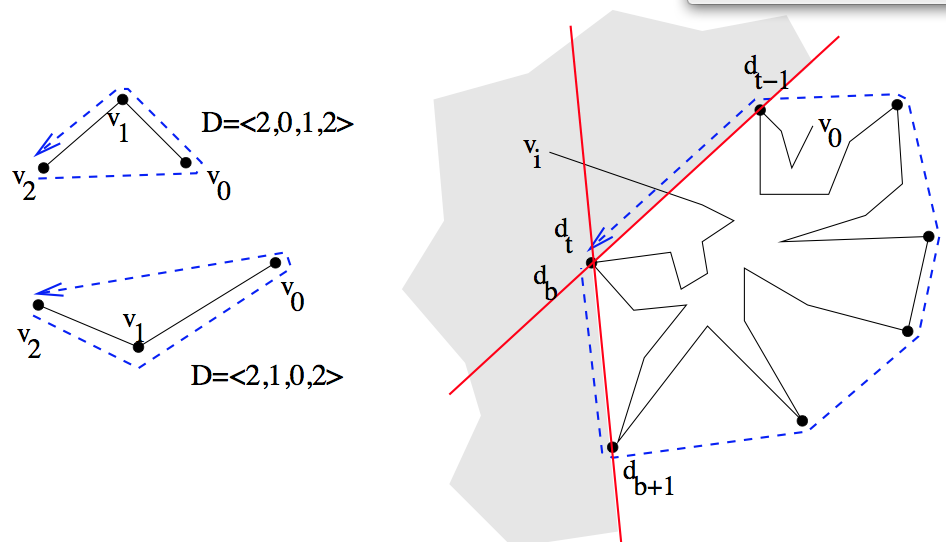

================================================================================
Computational Geometry: Basic structures, Convex Hulls and Randomized Algorithms
================================================================================

:author: David Coeurjolly

Basic elements
==============

Context
-------

**Objects**

* Point sets in `\mathbb{R}^d`:math:
* Point sets with combinatorial structures

  * Triangular mesh (combinatorial manifold)
  * Tetrahedral mesh
  * Simplicial characterization

* Family of shapes (segments, circles, ...)

**Geometrical problems**

* Collision/Intersection/Proximity tests
* Point localization queries
* Manifold reconstruction from point sets
* ...

**Theoretical questions**

* Computational cost/size of data structure to answer given class of queries
* Correctness of given geometry processing algorithm
* Degeneracies and Robustness analysis
* ...

Geometrical Predicate Approach
------------------------------

**Idea**

* Rewrite geometrical algorithms in terms of series of

  * Elementary geometrical *operations* (e.g. point/line creation, ...)
  * Elementary geometrical *predicates*  (e.g. does two lines intersect?)

* Robustness and correctness rely on robust and correct implementation of such elementary predicate

**Example**

.. list-table::

 * - .. image:: _static/images/CG/orientation.*
         :width: 50%
         :align: center

   - .. image:: _static/images/CG/orientation_circle.*
         :width: 60%
         :align: center

 * - `Orientation(p,q,r)`:math:

   - `InCircle(p,q,r,s)`:math:

Segment processing
------------------

**Cross product**

* `\vec{u}\times\vec{v}`:math: 'norm' is the signed area of the parallelogram `\vec{u}, \vec{v}`:math:. Obviously, `\vec{u}\times\vec{v}=-\vec{v}\times\vec{u}`:math:

    .. image:: _static/images/CG/crossprod.*
          :width: 20%

**Orientation predicate = sign of the determinant**

  ..  image:: _static/images/CG/signdet.png
         :width: 40%

  .. math::
       Orientation(p,q,r) = sign( det\left ( \vec{pq},\vec{pr} \right ))

`\Rightarrow`:math: *{+, 0, - } output*

Notations
---------

Sometimes, Orientation is defined as the sign of the determinant of the following matrix

  .. math::
      \left [ \begin{array}{ccc} 1 & p_x & p_y\\1 & q_x & q_y\\1& r_x &r_y\end{array}\right]

Use-case 1: Detect segment intersection
---------------------------------------

**Problem**

Given `\{p_1,p_2,p_3,p_4\}`:math:, decide if `[p_1p_2]`:math: intersects `[p_3p_4]`:math:

**Algorithm**

* Simple reject case: if bounding box of `[p_1p_2]`:math: does not intersect the bounding box of  `[p_3p_4]`:math:

  * *requires exact predicates* `x_1 < x_2`:math: *on point coordinates*

* Segments intersects if each segment intersects the straight line defined by the other one

  *  `[p_1p_2]`:math: intersects `(p_3p_4)`:math: iff

     * `Orientation(p_3,p_4,p_1) \neq Orientation(p_3,p_4,p_2)`:math:

     * or specific cases when `Orientation(p_3,p_4,p_1) =     Orientation(p_3,p_4,p_2) =0`:math: (aligned segments)

  * We need *exact orientation predicates to handle all cases*

   ..  image:: _static/images/CG/segmsegm.png
         :width: 50%

Robustness
----------

**Orientation predicate implementation**

* Beside capacity issues (`x*y`:math: must be representable), exact computations for integer built-in types (int, long int, ...)
* IEEE 754 "double": specific bit for sign but issues may appear in product and subtraction `\Rightarrow`:math: *uncertainty*

<CF Robustness CGAL>

`\Rightarrow`:math: *Error control, filtered predicates, formal rewritting, interval computations ...*

Convex Hulls
============

Convex Hull 1: Graham's Scan
----------------------------

**Step 1**

Given a set of point `\{p_0,\ldots,p_n\}`:math: in `\mathbb{R}^2`:math:,

* W.l.o.g., let `p_0`:math: be the leftmost bottom points

* We sort remaining points `\{p_1,\ldots,p_n\}`:math: by polar angles

  .. image:: _static/images/CG/graham1.*
        :width: 50%
        :align: center

**Implementation**

* `Orientation(p_0,p_i,p_j)`:math: induces an polar order on points
    .. math::
        p_i \prec p_j

**Step 1 is in** `O(N\log N)`:math:

Convex Hull 1: Graham's Scan 2
------------------------------

**Step 2**

* `p_0`:math: is necessarily a point in the convex hull (we assume `p_i`:math:
  are sorted)
* We scan each point triplet and reject those inducing concave parts

**Algo**

.. code-block:: c

   Push(p0) to S
   Push(p1) to S
   Push(p2) to  S
   For i from 3 to N
     While the angle (head(S / {head(S)}) , head(S), p_i) is convex
       Pop(S);
     Push(p_i) to S;

**Step 2 is in** `O(N)`:math:

Illustration
------------

   .. image:: _static/images/CG/graham2.*
       :width: 30%
       :align: center

   .. image:: _static/images/CG/graham3.*
       :width: 100%
       :align: center

   .. image:: _static/images/CG/graham4.*
       :width: 110%
       :align: center

Illustration
------------

  .. image:: _static/images/CG/grahamend.*
        :width:  80%
        :align: center

Graham's scan
-------------

* `O(N\log N)`:math: algorithm
* Stack + Orientation predicate
* Can be transformed to be incremental

  * Point insertion in a sorted list
  * Local update of the convex hull (but could be in O(N) )

Convex Hull 2: QuickHull
------------------------

**Idea** Recursive approach with decimation principle

  .. image:: _static/images/CG/quickhull.*
        :width: 50%

.. code-block:: c

   function  QuickHull(Set S, Point pLeft, Point pRight)
   {
     if S == {pLeft, pRight} return edge [pLeft,pRight]

     pH = FurthestPoint(S, pLeft, pRight)
     S1 = points of S on the left of vector [pLeft,pH]
     S2 = points of S on the right of vector [pH,pRight]

     return QuickHull(S1,pLeft,pH) + QuickHull(S2,pH,pRight)
   }
   //starting from two points on the convex hull (details skipped but not tricks here)

**QuickHull is in** `O(N^2)`:math: **(but really fast)**

Dynamic convex hulls
--------------------

**Problem** we want to update CH(S + {p}) from CH(S)

* Key object: *supporting lines*

.. list-table::

 * -  .. image:: _static/images/CG/supportline.*
          :width: 100%

   -  .. image:: _static/images/CG/supportline2.*
          :width: 100%

**Supporting lines can be extracted in** `O(\log N)`:math: **with Orientation predicate**

`\Rightarrow`:math: incremental convex hull in `O(N \log N)`:math:

Related problem: Line - Convex intersection
-------------------------------------------

**Problem** Decide if a straight line intersect a convex polygon

<Cf board>

Specific convex hulls: Simple polygonal chain
---------------------------------------------

**Problem settings** Let `\{s_0, \ldots, s_{n-1}\}`:math: be a simple polygonal chain (no self-intersection)

**Solution** Melkman's algorithm

* Data structure : double ended queue (push/pop on top and insert/remove from the bottom)
* Incremental construction: `C_i=\{s_0,\ldots, s_i\}`:math: and `Q_i=CH(C_i)`:math:
* The *deque*  `D_i=<d_b,d_{b-1},\ldots,d_{t-1},d_t>`:math: stores the sequence of points in `Q_i`:math:  (with `d_b=d_t`:math:)

Melkman's algorithm
-------------------

.. code-block:: c

  //Init
  if Orientation(v0,v1,v2) then D=<v2,v0,v1,v2> else D=<v2,v1,v0,v2>
  i = 3;

  while (i<N)
  {
    //Simple case, no update required
    while (Orientation(d_{t-1},d_t,vi)) and Orientation(d_b,d_{b+1}, vi))
      i++;

    //Ok, vi is exterior to Q_i, we restore the convexity
    repeat
      pop(d_t)
    until Orientation(d_{t-1},d_t,vi);
    push(vi);
    repeat
      remove(d_b)
    until Orientation(vi,d_b,d_{b+1});
    insert(vi);
  }
  //Done

Thanks to the *simplicity* of the polygonal chain, correctness can be demonstrated with `O(N)`:math: complexity

Convex hulls in higher dimension
--------------------------------

Given a set S pf N points in space

**Dimension 2** CH(S) has  O(N) vertices/edges

**Dimension 3**

* any convex polytope with n vertices has

  * at most 3n-6 edges
  * at most 2n-4 facets

  (proof: convex polytope `\rightarrow`:math: planar graph `\rightarrow`:math: Euler's formula `n-n_e+n_f = 2`:math: and `2n_e\geq 3n_f`:math:)

* `\Rightarrow`:math: *complexity of CH(S) in 3-space is O(N)*

**Dimension d**

* *CH(S) as a complexity in* `O(N^{\lfloor d/2\rfloor})`:math:

Convex hull algorithms in 3-Space
---------------------------------

**Visibility based approaches**

Extract *visibility horizon* and update the convex hull

.. list-table::

 * -  .. image:: _static/images/CG/gift-1.*
          :width: 100%

   -  .. image:: _static/images/CG/gift-2.*
          :width: 100%

Output sensitive algorithms
---------------------------

**Idea**

Computational cost proportional to the output size.

**Dim 2**

* Jarvis's march `O(Nh)`:math:
* Kirkpatrick and Seidel `O(N\log h)`:math:

**Dim 3**

* Gift-Wrapping method `O(Nh)`:math:
* Chan's algorithm `O(N\log h)`:math:

**Dim d**

* Chan's algorithm `O(N\log h + (Nh)^{1-\frac{1}{\lfloor d/2\rfloor+1}}\log^{O(1)} N)`:math:

QuickHull in 3-space
--------------------

**Simple construction**

* Recursive construction starting from a *tetrahedron* and decimation principle
* At each step, construct a tetrahedron from a base triangle and its *furthest point*
* Iterative construction of the convex hull

* Quadratic complexity but very efficient*

Randomization on Computational Geometry
=======================================

Introduction
------------

**Idea**

For some  algorithms, *randomized* algorithm can be defined with *expected* computational cost

E.g. "the expected computational cost of algorithm A is O(N)"

**Keep in mind that**

* Usually, the input set is not random set (e.g. convex hull for a uniform distribution of points in space ...)
* but *randomness* in the order of which the points are processed

**Why?**

* In some algorithms, computational bottlenecks occur for specific sequences/configurations of points
* Shuffling the input sequence points  implies that we can prove that bottlenecks cannot occur often

Example: Binary Space Partitions
--------------------------------

**Idea**

Given a set of segments `\{s_i\}`:math:, we construct a binary tree partitioning the space such that each segment splits the space by its associated line `l(s_i)`:math:

   .. image:: _static/images/CG/bsp-1.*
         :width: 50%

* Widely used in many applications for fast visibility tests (first introduced in Doom ;))

Simple Tree construction
------------------------

`S=\{s_1,\ldots,s_n\}`:math:

.. code-block:: C

   function 2DBSP(S)
   {
      if (Card(S) <= 1)
         Create a tree T consisting of a single leaf node containing S
      else
      {
        //We split along l(s1) (first element of S)
        S+ = { s\cap l(s1)+, s in S);
        S- = { s\cap l(s1)-, s in S);
        T+ = 2DBSP(S+)
        T- = 2DBSP(S-)
        Create a tree T with root node v (S(v)={s in S, s subset l(s1)})
        and sub-trees T+ and T-
      }
      return T;
   }

* By construction, some segments can be decomposed into parts
* For specific sequences of segments, each "split" can generate `O(|S|)`:math: new segments (called **fragments**)

Randomization
-------------

.. code-block:: c

  function Random2DBSP(S)
  {
    Generate random permutation S'=s1, ..., sn of the set S
    return 2DBSP(S')
  }

*Nice, but does it help to  bound the number of fragments ?*

**Main result**

.. admonition:: Thm.

   The *expected* number of fragments generated by Random2DBSP is `O(n\log n)`:math:

(instead of `O(n^2)`:math: with naive approach)

Observation: The order matters
------------------------------

   .. image:: _static/images/CG/bsp-2.*
         :width: 100%

Proof
-----

* We want to compute how many fragments are induced by `s_i`:math:
* We define `dist_{s_i}(s_j)`:math: the *number of segments intersecting* `l(s_i)`:math: *in between* `s_i`:math: and `s_j`:math:

(`dist_{s_i}(s_j)=+\infty`:math: if `l(s_i)`:math: does not intersect `s_j`:math:)

   .. image:: _static/images/CG/bsp-3.*
         :width: 30%

Let us define `k = dist_{s_i}(s_j)`:math: and let `s_{j1}, s_{j2}, \ldots, s_{jk}`:math: be such segments between `s_i`:math: and `s_j`:math:.

*Question* what is the probability that `l(s_i)`:math: cut `s_j`:math: ?

* `s_i`:math: must be before `s_j`:math: is the random sequence. Moreover, `s_i`:math: must be before all segments `\{s_{jk}\}`:math:
* By uniformity hypothesis on the random permutation

    .. math::
         \Rightarrow  Prob[l(s_i)\text{ cut }s_j] = \frac{1}{dist_{s_i}(s_j) + 2}

Proof (bis)
-----------

Some segments `s_m`:math: may exist such that `l(s_m)`:math:  *shield* `s_j`:math: from `s_i`:math:. Hence, we do not have an equality in the Expectation expression:

   .. math::
      \begin{align}
       E[\text{number of fragments generated by }s_i]& \leq
       \sum_{j\neq i} \frac{1}{dist_{s_i}(s_j) + 2}\\& \leq
       2\sum_{k=0}^{n-2} \frac{1}{k + 2}\\ & \leq  2 \ln(n)
       \end{align}

.. raw:: latex

       \begin{align}
       E[\text{number of fragments generated by }s_i]& \leq
       \sum_{j\neq i} \frac{1}{dist_{s_i}(s_j) + 2}\\& \leq
       2\sum_{k=0}^{n-2} \frac{1}{k + 2}\\ & \leq  2 \ln(n)
       \end{align}

`\Rightarrow`:math: **By linearity of expectation, the expected number of segments is** `n + 2n \ln(n)`:math:
