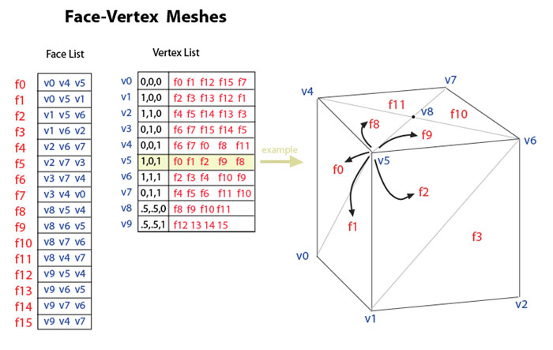
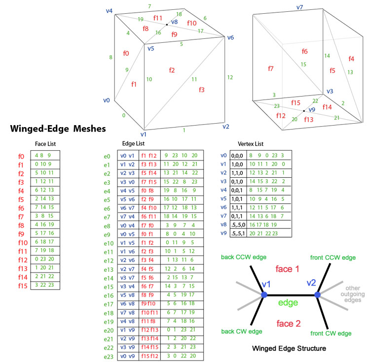
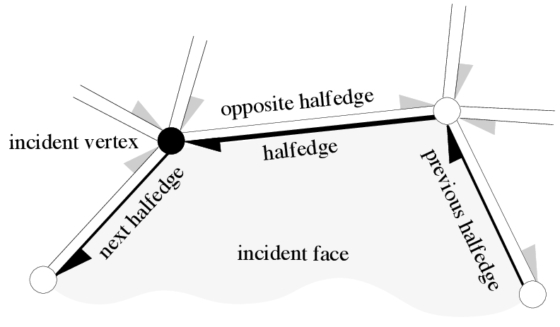
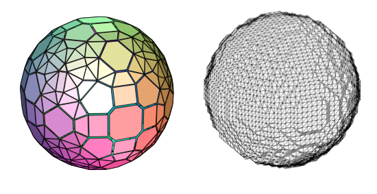
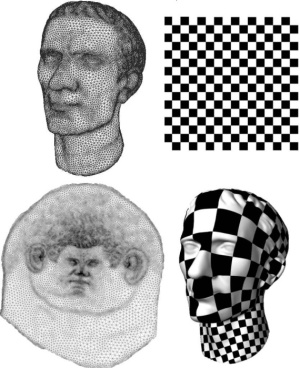
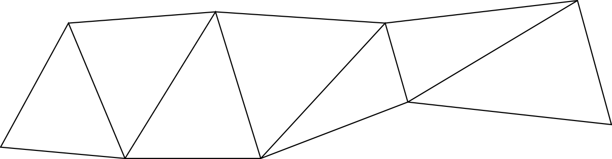

===============
Mesh Processing
===============

:author: David Coeurjolly

.. |imp| replace:: `\Rightarrow`:math:

Mesh representation
===================

Overview
--------

**Rough definition**

.. admonition:: Def.

   A mesh is a piecewise linear geometrical structure embedded in `\mathbb{R}^d`:math:

**Usually, we assume**

* Meshes contain a *combinatorial strucutre* (no a soup of triangles)
* The *geometry* is mostly defined by vertices coordinates

**For instance, we can consider**

.. list-table::

  - * .. image:: _static/images/CG/Mesh/triangular.png
         :width: 80%
         :align: center

    * .. image:: _static/images/CG/Mesh/quad.png
         :width: 80%
         :align: center

    * .. image:: _static/images/CG/Mesh/tetra.png
         :width: 80%
         :align: center

  - * Triangular meshes
    * Quadtrilateral meshes
    * Tetrahedral meshes

Overview (bis)
--------------

**Why meshes?**

* Provide topological information

* Useful in many applications:  modeling, rendering, numerical simulation, ...

.. image:: _static/images/introduction.jpg
   :width: 100%
   :align: center

Formal characterization 1: Simplifical Complexes
------------------------------------------------

**Cellular structure**

Vertices (0-cell), edges (1-cell), triangles (2-cell), tetrahedon (3-cell) |imp| *simplices*

.. admonition:: Def. Simplex

    A *k-simplex* is a k-dimensional polytope which is the convex hull
    of its k + 1 affinely independent vertices

.. admonition:: Def. Simplicial Complex

  A *simplicial complex* `\mathcal{K}`:math: is a set of simplices that
  satisfies the following conditions:

  1. Any face of a simplex from `\mathcal{K}`:math: is also in `\mathcal{K}`:math:
  2. The intersection of any two simplices `\sigma_1`:math:, `\sigma_2 \in \mathcal{K}`:math: is a face of both `\sigma_1`:math: and `\sigma_2`:math:

.. list-table::

 - * .. image:: _static/images/CG/Mesh/complexsimpl.png
         :width: 50%
         :align: center

   * .. image:: _static/images/CG/Mesh/notcomplex.png
         :width: 30%
         :align: center

Formal characterization 1: Simplifical Complexes (bis)
------------------------------------------------------

|imp| **Strong topological structure (order, boundary, co-boundary,
each simplex is topological ball)**

|imp| **Many topological operations on meshes can be described as k-simplices operations**

|imp| **Specific combinatoric makes  implementation easy**

Formal characterization 2: Cellular Complexes
---------------------------------------------

**We remove the constraint that** *k-cells* **are defined  by** *k+1-vertices*

.. image::  _static/images/CG/Mesh/cellcompl.png
    :width: 50%
    :align: center

**..but..**

* Cells are not topological balls anymore

* |imp| restricted cases (*CW-complexes*)
* |imp| combinatorial characterization (*Combinatorial Maps*)

Implementations
---------------

.. image:: _static/images/CG/Mesh/vertvert.png
         :width: 60%
         :align: center

+ Iteration on vertices
+ Neighboring vertices

+ *no explicit representation of faces*

Implementations
---------------

+ direct access to faces
+ Mesh representation data structures on GPU
+ Optional backlink from vertices to faces

+ *no easy access to faces neighbors*

Implementations
---------------

**Neighboring faces for triangular meshes can be stored in a explicit structure**

   AdjF: `\quad f_i \rightarrow`:math: `\{f_a,f_b,f_c\}`:math:

**...but...** not efficient for *cellular meshes*

Implementation: Winged-edge
---------------------------

Implementation: Half-edge
-------------------------
**Double-linked list of edges**

* Orientation matters !
* Faces can be made implicit from half-edges cycles
* Geometry (vertices) is attached as membres of half-edges
* For example, cycling around vertex can be done by sequences of
  {opposite/prev} operations on HS

*cgal.org*

Implementation: Half-edge (bis)
-------------------------------

**Core topological operations maintaining the structure**

.. list-table::

   - * .. image:: _static/images/CG/Mesh/euler_facet.png
           :width: 80%
           :align: center

     * .. image:: _static/images/CG/Mesh/euler_vertex.png
           :width: 80%
           :align: center

   - * .. image:: _static/images/CG/Mesh/euler_center.png
           :width: 80%
           :align: center

     * .. image:: _static/images/CG/Mesh/euler_loop.png
           :width: 80%
           :align: center

   - * .. image:: _static/images/CG/Mesh/add_facet1.png
           :width: 80%
           :align: center

     * .. image:: _static/images/CG/Mesh/add_facet2.png
           :width: 80%
           :align: center

*cgal.org*

Generic model: Combinatorial Maps
---------------------------------

**Valid combinatorial model in any dimension**

* darts
* involutions/permutations `\beta_i`:math: (`i\in\{1\ldots n\}`:math:)
  on dart labels to encode the structure
* Formal constraints on involutions to ensure valid topological maps

.. list-table::

 - * .. image:: _static/images/CG/Mesh/combmap2.png
         :width: 100%
         :align: center

   * .. image:: _static/images/CG/Mesh/combmap.png
         :width: 110%
         :align: center

*cgal.org*

Mesh processing examples
========================

Shape from mesh subdivision
---------------------------

**Principle**

Start from a *control mesh* and apply local subdivision rules to
generate finer object.

.. image:: _static/images/CG/Mesh/subdiv_small.png
      :width: 40%
      :align: center

**Subdivision rule**

* Several schemes

  * 1 triangle -> 4  triangles
  * 1 quad -> 4 quads
  * ...

* Interpolation function for new vertices positions

**Main idea**: from the subdivison mechanism we can prove that the
limit surface is (`C^1`:math:, `C^2`:math:,...)

*Related* to B-spline schemes

Examples
--------

.. list-table::

  - * .. image:: _static/images/CG/Mesh/catmull.png
          :width: 100%
          :align: center

    * .. image:: _static/images/CG/Mesh/loop.png
          :width: 50%
          :align: center

    * .. image:: _static/images/CG/Mesh/doosabin.png
          :width: 120%
          :align: center

(resp. Catmull-Clark, Loop, Doo-Sabin)

Mesh simplification
-------------------

**Principle**

Optimize the size of input mesh removing *unnecessary* triangles

**More formally**

* Compute `\mathcal{M}'`:math: with
  `|\mathcal{M}'|<|\mathcal{M}|`:math: and

   .. math::
         d(\mathcal{M},\mathcal{M'}) < \epsilon

*What kind of shape metric d ?*

Simple Example
--------------

**Local metric evaluation**

* For each vertex evaluate its distance to its tangent plane
* If the distance is less than `\epsilon`:math:, we remove the point
  and triangulate its one-ring

.. list-table::

  - * .. image:: _static/images/CG/Mesh/schroeder.png
         :width: 100%
         :align: center

    * .. image:: _static/images/CG/Mesh/res-schroeder.png
          :width: 120%
          :align: center

*Fast and easy implement but*

* **No global metric guarantee**
* **Topological must be ensured on local edits**

Mesh parametrization
--------------------

**Idea**

Parametrized a complex mesh (2-manifold) on a 2D parameter space `[U,V]`:math:

**Issues**

* Planar embedding may not exist for some shapes
* We would like the embedding to preserve some information (metric,
  area, angles,...)

**Many applications**

.. list-table::

   - * * Texture mapping
       * Geometry processing
       * Remeshing
       * ...

     * .. image:: _static/images/CG/Mesh/conformalTexture.png
           :width: 60%
           :align: center

Mesh parametrization example
----------------------------

**Conformal Parametrization**

.. list-table::

 - *  * Angle preserving transformation in complex plane

   * .. image:: _static/images/CG/Mesh/conformal.png
         :width: 20%
         :align: center

**Discrete formulation**

.. admonition:: Defs.

    Two meshes `\mathcal{M}`:math:  `\mathcal{M}'`:math: with same
    topology are (conformally) equivalent iff `\exists \{u_i\}`:math:
    such that

        .. math::
               \tilde{l}_{ij} = e^{(u_i + u_j)/2} l_{ij}

    or equivalently (logspace)

        .. math::
           \tilde{\lambda}_{ij} = \lambda_{ij} + u_i + u_j

|imp| *linear formulation*

Mesh parametrization example
----------------------------

**Topological issues**

* if  `\mathcal{M}`:math: is *homeomorphic to a disk*, there exist a
  conformal map to plane [U,V]
* if  `\mathcal{M}`:math: is *homeomorphic to a sphere*, there exist a  conformal map from `\mathcal{M}`:math:  to a unit sphere
* ... but maps are harder to manipulate for high genus surfaces

**Practical solution: Cut and Open**

.. image:: _static/images/CG/Mesh/cut.png
    :width: 40%
    :align: center

Mesh Compression
----------------

**Idea**

Half-edge or Vertex-Edge data structure contains redundant information
that can be compressed

**We want to**

* compress the geometry (with or without loss)
* compress the combinatorial structure
* We may be interested in streamed decompression

**Example: Triangular strip**

*<see balckboard>*

* *Separate geometric + combinatorial encoders/decoders*
* Joint encoders from *signal represnetation* of the meshes (wavelets,...)
* ...
