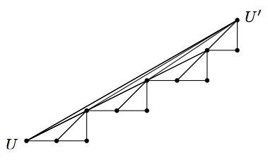
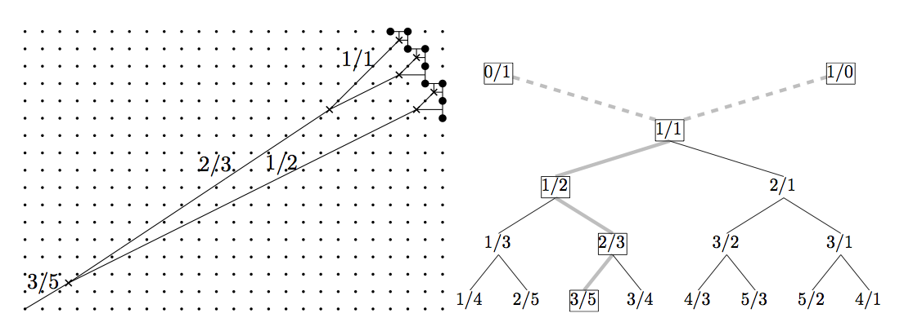
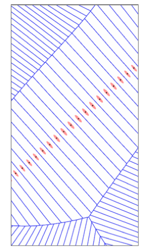
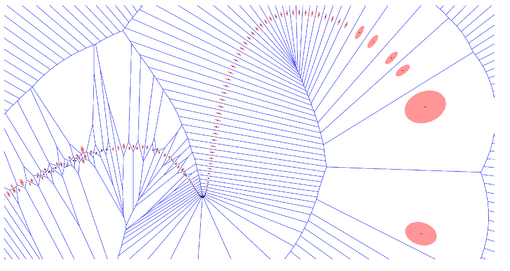
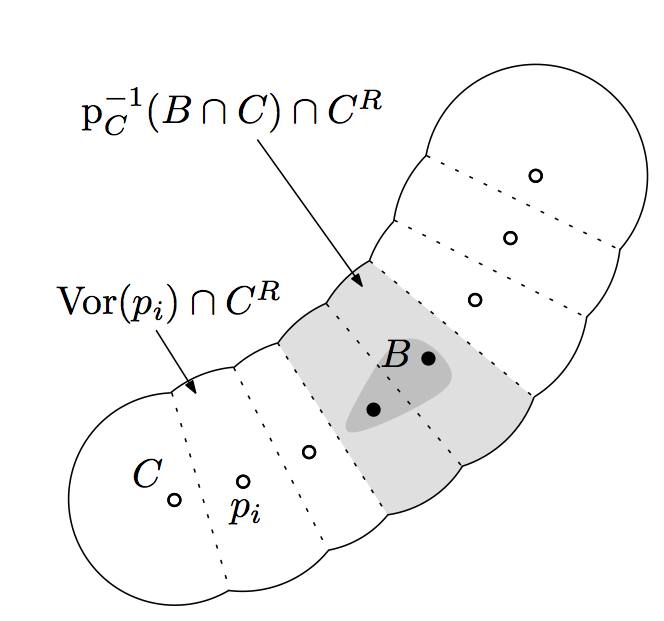
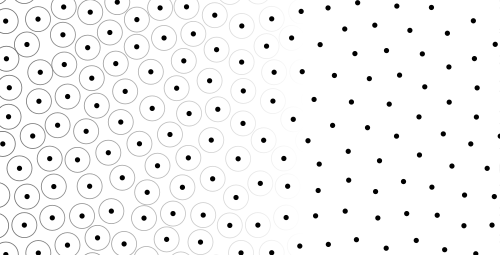
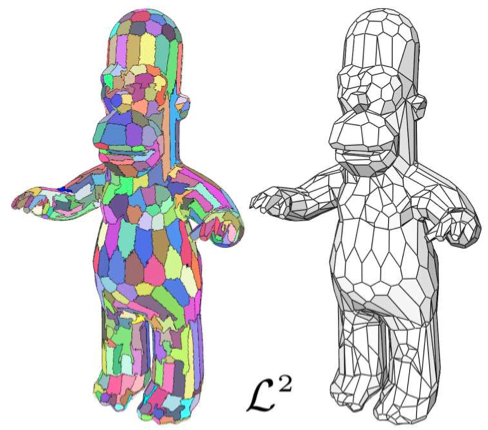
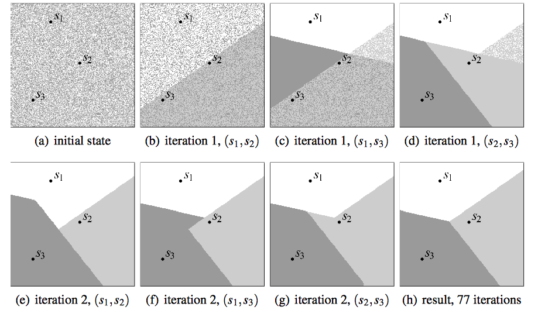
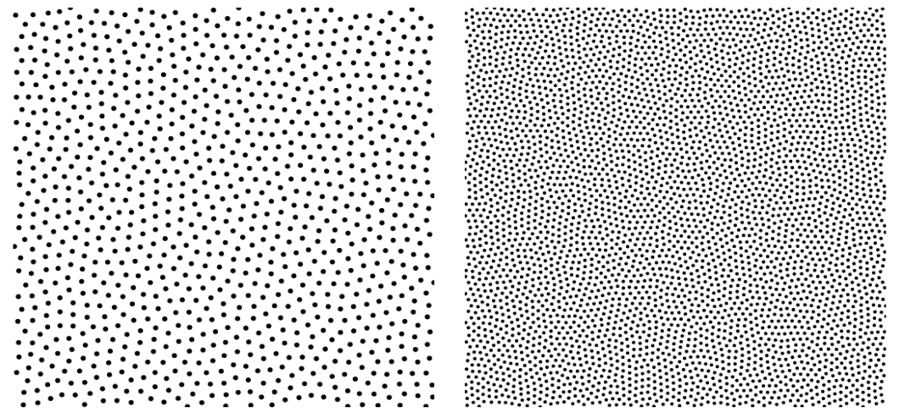
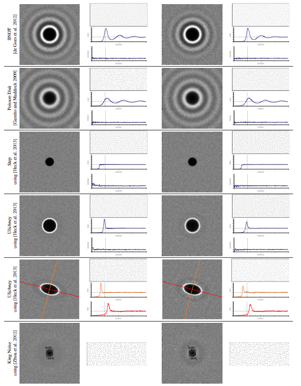

=======================================================================
Computational Geometry: Digital Delaunay Triangulation and Applications
=======================================================================

:author: David Coeurjolly

Digital Delaunay Triangulation
==============================

Description
-----------

**Input**

* Points from the digital contour of an object

*local consistency of points*

* Points in `[0,N]^d`:math:

*specific integer based structures*

**Let's start with good news**

* Exact InCircle predicates thanks to integer coordinates

**... and the bad ones**

* On the regular lattice, we have many co-cyclic points
* No `\epsilon`:math: perturbation can be done

**Questions**

  *Can we expect better bounds for Delaunay structure?*

Digital Contour
---------------

**Delaunay triangulation from minimum spanning tree**

.. admonition:: Thm. [Devillers]

   If the **Euclidean Minimum Spanning Tree** of the input point set,
   the whole triangulation can be constructed in expected time `O(n
   \log^* n)`:math:

(`\log^* n=\inf\{k;\log(k)n\leq 1\}`:math: hence for `16<n\leq 65532`:math:, `\log^*
n=4`:math:,  `\log^* n= 5`:math:  for `n<2^{65532}`:math:)

.. image:: _static/images/CG/DelDiscret/Minimum_spanning_tree.*
      :width: 30%
      :align: center

**Why?**

* All edges of the EMST are Delaunay Edges
* *Even true for any spanning subgraph of the Delaunay structure with
  maximal degree d*

Digital Contour (bis)
---------------------

**Main observation**

.. admonition:: Thm.

      The polyline defined from digital contour points is a Delaunay
      spanning graph with maximal degree 2

.. admonition:: Thm.

    **Expected time for Delaunay construction for digital contour is in** `O(n \log^* n)`:math:

* Deterministic algorithm exists in dimension 2

.. list-table::

   * - .. image:: _static/images/CG/DelDiscret/delaunay-5.png
            :width: 100%
            :align: center

     - .. image:: _static/images/CG/DelDiscret/delaunay-10.png
            :width: 100%
            :align: center

     - .. image:: _static/images/CG/DelDiscret/delaunay-100.png
            :width: 100%
            :align: center

Digital Straight Segment Pattern
--------------------------------

**Observation**

For digital straight segment patterns, can we recover the Delaunay
structure from arthimetic properties?

`\Rightarrow`:math: **Yes!** [Roussillon, Lachaud]

Digital Points
--------------

**Setting**

* Digital points in `M\times M`:math: domain

**Main Result**

.. admonition:: Thm. [Chan]

    `O(n \sqrt{\log M})`:math: expected randomized time for Delaunay   Triangulation construction

**Key Data Structure: Van Emde Boas Tree**

* Associative array with M-bit integer keys
* Insert/Delete/Find/../ in `O(\log M)`:math: !!

Delaunay/Voronoi Applications: Reconstruction and Differential Estimators
=========================================================================

Surface Reconstruction
----------------------

**Settings**

Set `S`:math: with `n`:math: points *sampling/approximating* a smooth 2-manifold C can I reconstruct a  discrete manifold M such that

- `d(M,C)<\epsilon`:math: for some metric d (e.g. Haussdorff)

- M is homeomorphic to C

**Variants**

* How to control the sampling?

*Example of theorem statement*  If sample set `S`:math: has good sampling properties
    parametrized by `\epsilon_0`:math: (e.g. at least `d_H(S,C)<
    \epsilon_0`:math:), then for samplings with
    `\epsilon<\epsilon_0`:math: Algorithm A produces a discrete structure
    homeomorphic to C

* What kind of algorithmic tools  or structure?

Example: Power Crust Reconstruction [Amenta]
--------------------------------------------

**Sampling Definition**

.. admonition:: Def.

    `S`:math: is an `\epsilon`:math:-sampling of `\partial C`:math: if
    `S\subset\partial C`:math: and `\forall x\in\partial C`:math:, `\exists
    p\in S`:math: such that `d(p,x)< \epsilon\cdot lfs(x)`:math:.

with lfs(x) being the *local feature size* at x: `lfs(x)= d(x,MedialAxis(C))`:math:

* `\epsilon`:math:-samples are on `\partial C`:math:
* `\epsilon`:math: is be used to control the number of samples and its
  distribution.

*Question* what does  `d(p,x)< \epsilon \cdot lfs(x)`:math:  mean?

Example: Power Crust Reconstruction [Amenta] (bis)
--------------------------------------------------
.. list-table::

  - * Compute the Voronoi Diagram of `S`:math:

    * .. image:: _static/images/CG/DelApp/crust1.png
           :width: 45%
           :align: center

Example: Power Crust Reconstruction [Amenta] (bis)
--------------------------------------------------
.. list-table::

  - * Compute the Voronoi Diagram of `S`:math:

    * .. image:: _static/images/CG/DelApp/crust1.png
           :width: 45%
           :align: center

  - * Extract the *poles* and *polar balls*

    * .. image:: _static/images/CG/DelApp/crust2.png
           :width: 45%
           :align: center

*pole of a sample s*: pair of power diagram vertices farthest from s
on either the inside or outside of the "object".

Example: Power Crust Reconstruction [Amenta] (bis)
--------------------------------------------------
.. list-table::

  - * Compute the Voronoi Diagram of `S`:math:

    * .. image:: _static/images/CG/DelApp/crust1.png
           :width: 45%
           :align: center

  - * Extract the *poles* and *polar balls*

    * .. image:: _static/images/CG/DelApp/crust2.png
           :width: 45%
           :align: center

  - * Compute the *Power Diagram* of such *poles*

    * .. image:: _static/images/CG/DelApp/crust3.png
           :width: 45%
           :align: center

Example: Power Crust Reconstruction [Amenta] (bis)
--------------------------------------------------
.. list-table::

  - * Compute the Voronoi Diagram of `S`:math:

    * .. image:: _static/images/CG/DelApp/crust1.png
           :width: 45%
           :align: center

  - * Extract the *poles* and construct

    * .. image:: _static/images/CG/DelApp/crust2.png
           :width: 45%
           :align: center

  - * Compute the *Power Diagram* of such *poles*

    * .. image:: _static/images/CG/DelApp/crust3.png
           :width: 45%
           :align: center

  - * Extract the power crust

    * .. image:: _static/images/CG/DelApp/crust4.png
           :width: 45%
           :align: center

Example: Power Crust Reconstruction [Amenta] (ter)
--------------------------------------------------

.. admonition:: Thm.

   * Homotopy equivalence result for some `\epsilon < \epsilon_0`:math:

   * Distance between power crust and C tends to 0 when `\epsilon \rightarrow 0`:math:

.. list-table::

   *  - .. image:: _static/images/CG/DelApp/crustex.png
            :width: 100%
            :align: center

      - .. image:: _static/images/CG/DelApp/crustex2.png
             :width: 100%
             :align: center

Differential Estimation From the Voronoi Diagram
------------------------------------------------

**Side-product of Power Crust**

.. admonition:: Thm.

                Direction `(p_1,p_2)`:math: from poles `p_1`:math: and
                `p_2`:math: at a sample s is a convergent
                (w.r.t. `\epsilon`:math:) estimation of the normal
                direction at s

Differential Estimation From the Voronoi Diagram
------------------------------------------------

**...but very sensitive to noise or sampling conditions**

keep in mind that in theorems, `S`:math: samples C exactly

.. image:: _static/images/CG/DelApp/normalbruit.png
             :width: 40%
             :align: center

**Alternative solutions**: use Voronoi cell covariance matrix [Alliez]

Example
-------

Robust Voronoi-based curvature and feature estimation [Mérigot..]
-----------------------------------------------------------------

**Idea**

Covariance matrix is still a key tool but it is evaluated on
*r-offest* of the input set

.. admonition:: Thm.

    Eigenvalues/Eigenvectors of the covariance matrix at a point are
    related to principal curvature/principal curvature direction

    Convergence results exist with Haussdorff hypothesis on the point
    set

Robust Voronoi-based curvature and feature estimation [Mérigot..]
-----------------------------------------------------------------

**Robust tool for feature extraction**

.. image:: _static/images/CG/DelApp/merigotex.png
       :width: 100%
       :align: center

Point Sampling
==============

Context: Monte-Carlo Integration
--------------------------------

**Idea**

Estimate

   .. math::
       \int_{\Omega}f(\overline{\mathbf{x}}) \, d\overline{\mathbf{x}}

from

.. list-table::

  - *   `\frac{1}{N} \sum_{i=1}^N f(\overline{\mathbf{x}}_i)`:math:

    *  .. image:: _static/images/CG/DelApp/Pi_30K.*
            :width: 50%
            :align: center

**Many fields**

* Numerical analysis
* Image rendering
* ...

Sampling Quality Evaluation
---------------------------

**Variance in the Monte-Carlo Integration process (uniform sampling)**

* `\mathrm{Var}(S_N) =  \frac{V^2}{N^2} \sum_{i=1}^N \mathrm{Var}(f) =
  V^2\frac{\mathrm{Var}(f)}{N} = V^2\frac{\sigma_N^2}{N}`:math:

* Integration error :

    .. math::
      \delta S_N\approx\sqrt{\mathrm{Var}(S_N)}=V\frac{\sigma_N}{\sqrt{N}}

**Spectral properties**

* No high energy peaks
* Control of the point sampling spectrum shape

Stochastic Approaches
---------------------

**Uniform sampling**

* white noise
* fast
* rely on pseudo-number random generator

**Jittered/Stratified sampling**

* Grid structure and uniform sampling in each cell
* enhance local consistency
* we loose some stochastic properties

.. image:: _static/images/CG/DelApp/sampling_stratified_random.gif
    :width: 30%
    :align: center

Stochastic Approaches (bis)
---------------------------
**Poisson Disk**

* Throw darts with "forbidden" zones
* Good spectral properties but hard to generate efficiently

Deterministic Approaches
------------------------

**Low discrepancy sequences** Quasi-Monte-Carlo approaches

.. image:: _static/images/CG/DelApp/Subrandom_2D.png
          :width: 60%
          :align: center

**Tiled based approaches**

.. image:: _static/images/CG/DelApp/paving.png
          :width: 100%
          :align: center

Voronoi Diagram based Approaches: Llyod's relaxation
-----------------------------------------------------

**Description**  Iterative algorithm

.. code-block:: c

   Generate N points using uniform sampling
   Compute its Voronoi diagram V

   while (not(stability))
   {
      For each cell
        Compute its centroid
        Move site to the centroid
   }

.. list-table::

  - * .. image:: _static/images/CG/DelApp/lloyd1.png
          :width: 100%
          :align: center

    * .. image:: _static/images/CG/DelApp/lloyd2.png
          :width: 100%
          :align: center

    * .. image:: _static/images/CG/DelApp/lloyd3.png
          :width: 100%
          :align: center

    * .. image:: _static/images/CG/DelApp/lloyd15.png
          :width: 100%
          :align: center

**Converges** to a stable structure (honeycomb) but if we *stop* the
process, we obtain a reasonable point sampling

On 3D surfaces for remeshing
----------------------------

*[Cohen-Steiner et al]*

Capacity Constrained Voronoi Diagram
------------------------------------

**Equi-distribution of samples** `\equiv`:math: **Cells with same capacity**

**Isotropic influence zone of samples** `\Rightarrow`:math: **Energy model on
cell shapes**

* `\Rightarrow`:math: iterative process to minimize global energy
* `\Rightarrow`:math: related to power diagram

*Discrete version*

CCVT Example
------------

Many variants/alternatives
--------------------------

**Experimental comparison**

.. list-table::

  - * .. image:: _static/images/CG/DelApp/bnot.png
          :width: 70%
          :align: center

    * .. image:: _static/images/CG/DelApp/ramp.png
           :width: 100%
           :align: center

Many variants/alternatives
--------------------------

