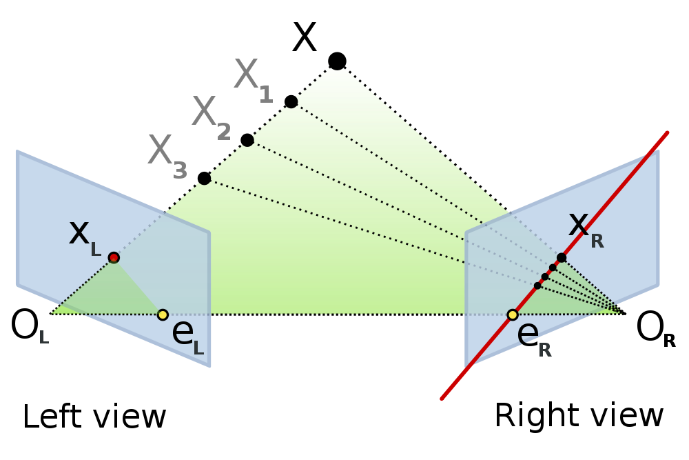

=============================================================
Introduction, numerical images and geometrical representation
=============================================================
:author: David Coeurjolly

.. list-table::
   :class: columns

   * -

     -

     - .. image:: ./_static/images/mosaique.png
          :width: 80%
     - .. image:: ./_static/images/snapshot-K.png
          :width: 80%

Preliminaries
=============

Goals
-----

**Lectures**

* Introduce fundamental concepts in computer graphics, image
  processing, digital geometry and computational geometry
* Illustrate links between geometrical analysis of shapes and related
  fields (complexity, arithmetic, word theory, ....)

**Practical work (TP)**

* Implement some image processing/shape analysis tools
* Comparative evaluation principles (tests, asymptotic
  vs. experimental computational costs...)

Infrastructure
--------------

**Github project**   https://github.com/dcoeurjo/lectureDG

* Lecture sources
* Practical work

.. code-block:: bash

   git clone https://github.com/dcoeurjo/lectureDG.git

**Practical work**

* Mostly based on DGtal (http://libdgtal.org)

   .. image:: ./_static/images/logoDGtal.png
       :width: 50%

**Homework, project, final exam**

* One practical work session will be evaluated
* Homework
* Final exam

Context:   Analysis of geometrical objects
------------------------------------------

**Geometrical objets**

* From acquisition devices

  * CCD devices
  * tomographic images (IRM, scanners X, ...)

* From modeling processes

  * Geometrical modelers, CAD (computer-aided design)
  * From mathematical modeling of phenomena

**Analysis**

* ... computer-based -> *algorithms*
* ... quantitative

  * Scalar shape descriptors
  * Geometrical paramters
  * Topological invariants, ...
  *  -> *quality, robustness, certified computations, ...*

Couple of Acquisition Devices
=============================

CCD Device
----------
*Charged-Coupled Device*

**Principles** photo-active regions/pixels : each unit if surface
element accumulate some electrical charges proportional to the
intensity of received light

    *photon -> electron charges*

.. list-table::
   :class: columns

   * - .. image:: ./_static/images/CCD_1D.JPG
          :width: 100%
     - .. image:: ./_static/images/CCD_2D.jpg
          :width: 70%
          :align: center
     - .. image:: ./_static/images/Bayer_pattern_on_sensor.*
          :width: 100%
   * - Linear device [#]_
     - 2D device  [#]_
     - Bayer pattern [#]_

**Physical notion of  pixels**

.. image:: ./_static/images/CCD_pixels.png
    :align: center
    :width: 70%

[#]_

.. note ::
  .. [#] http://en.wikipedia.org/wiki/File:CCD_line_sensor.JPG
  .. [#] http://fr.wikipedia.org/wiki/Fichier:CCD_in_camera.jpg
  .. [#] http://en.wikipedia.org/wiki/File:Bayer_pattern_on_sensor.*
  .. [#] http://fr.wikipedia.org/wiki/Fichier:CCD_Sensor_Layout_Evolution.png

Associated Modeling
-------------------

By *construction*

* Underlying support geometry is induced by a periodic tiling
* Values are quantified on a small number of bits

.. admonition:: def.

     Image:`\qquad S \subset \mathbb{Z}^n \rightarrow Q\subset \mathbb{Z}^+`:math:

Tomography
----------

**Principles**

* particles are emitted (ions, protons, photons, ...) from a source
  device to a target (object, body, ...)

* a detector measures particles intensity after the object
  traversal. The intensity decay is a function of the time flight and
  the traversed material)

* the image is reconstructed from attenuation measurements *using
  back-projection approaches*

.. list-table::
   :class: columns

   * - .. image:: ./_static/images/Line_Beam.jpg
          :width: 60%
          :align: center

     - .. image:: ./_static/images/Cone_beam.jpg
          :width: 60%
          :align: center

[#]_ [#]_

.. note ::

  .. [#] http://en.wikipedia.org/wiki/File:CT_Scanner_Line_Beam.jpg
  .. [#] http://en.wikipedia.org/wiki/File:Cone_beam_image_Cam_320x240.jpg

Tomography (bis)
----------------

**Basic Idea**  Randon's Theorem

    `[Rf](t,\theta) = \int_{-\infty}^{+\infty} \int_{-\infty}^{+\infty} f(x,y)\delta(t-x \cos(\theta) - y \sin(\theta)) dxdy`:math:

`\delta`:math:  Dirac measures

    .. image:: ./_static/images/sinogramme.png
        :width: 60%

.. rst-class:: roundedquote

     *<demo>*

Digital Tomography
------------------

**Specificities**

* Projection directions: rational straight lines  `ax-by=c`:math: (`a,b,c\in\mathbb{Z}`:math:)
* Projection function: sum of digital point values along the rational
  straight line
* Data to reconstruct: binary values {0,1} or in
  `\mathbb{Z}`:math:

**Problems**

.. list-table::

 * - * Number of required projections
     * Uniqueness of the reconstruction
     * Sometimes, further hypotheses are required (convexity,
       smoothness, ...)

   - .. image:: ./_static/images/pasunicite.png
         :width: 100%
         :align: center

Example:  Mojette Transform
----------------------------

.. container:: build animation

  .. image:: ./_static/images/mojetteempty.*

  .. image:: ./_static/images/mojettefull.*

Digital Tomography: conclusion
------------------------------

By  *construction* or for *efficiency* of the reconstruction process
from projections, the result isusually defined in **regular lattices**
in 2D or 3D

.. admonition:: def.

     Image:`\qquad S \subset \mathbb{Z}^n \rightarrow Q\subset \mathbb{Z}^+`:math:

Acquisition from  laser/ultrasound/contact
------------------------------------------

**Mechanical contacts** probe measurements from motorized systems

**Approches based on time-of-flight computations** (e.g. laser or
sonar rangefinder, ...)

.. list-table::

    * - * measures the time taken by the pulse to be reflected off
          the target and returned to the sender
        * *data* =  distance of the target from the source en a set of
          directions. After reconstruction, `\{(x,y,z)\}\in\mathbb{R}^3`:math:

      - .. image:: _static/images/Lidar_P1270901.jpg
           :width: 50%
           :align: center

Reconstruction from triangulation principle
-------------------------------------------

.. list-table::

    * -  * Input: a pulse (or series of) is emitted from the source
               and *observed* if a detector (ex. laser + CCD)
         * Relative position of the source and the detector is known
           and thus
         * From  2D positions in the detector,

         * *data* = After calibration and reconstruction, a point cloud
           `\{(x,y,z)\}\in\mathbb{R}^3`:math:

      - .. image:: _static/images/LaserPrinciple.png
           :width: 100%
           :align: center

Reconstruction from images: example with Epipolar Geometry
----------------------------------------------------------

[#]_

.. [#] http://en.wikipedia.org/wiki/File:Epipolar_geometry.svg

Hybrid approach:  Kinect
------------------------

.. list-table::

   * - * Color camera (CCD, 640x480)
       * *Pattern projection in infrared*  +  CMOS  detector (~640x480)

     - .. image:: _static/images/Xbox-360-Kinect-Standalone.png
        :width: 80%
        :align: center

.. list-table::

   * - .. image:: _static/images//Kinect2-ir-image.png
        :width: 80%
        :align: center

     - .. image:: _static/images/Kinect2-deepmap.png
        :width: 80%
        :align: center

*Raw data* = Depth map in the detector plane  + color image

Quiz: why infrared ?

Bottlenecks/Problems to consider
--------------------------------

.. list-table::

  * - .. image:: _static/images/registration_outdoor.png
       :width: 100%
       :align: center
    - .. image:: _static/images/registration_closeup.png
       :width: 100%
       :align: center

* Filtering (noise, *outliers*,...)
* Point cloud *registration* (by device calibration or from data processing)   [#]_
* Local density control
* How to deal wit occluded regions ?
* ...

.. [#] Point Cloud Library

Bottlenecks/Problems to consider (bis)
--------------------------------------

**Geometrical reconstruction** define a  *high quality manifold*
*approximating* or *interpolating* the point cloud. [#]_

.. image:: _static/images/introduction.jpg
   :width: 60%
   :align: center

* *Manifold* cf later
* *Quality*

  * distance to samples (which métrique ? how to be robust to noise ?...)
  * Smoothness of the reconstruction
  * Geometrical and topological certificate of the  reconstruction
* ...

.. [#] CGAL.org

Some External Devices
=====================

Raster Screens
--------------

**Principles**

* Luminophores with  RGB cells (red, green, blue)  to render colors
  by additivity

* In our context

  - Color image : `[0..n]\times[0..m] -> Q^3`:math:
  - `Q`:math: : range of each color channel (8bits, 24bits, ...)

.. list-table::

 * - .. image:: _static/images/CRT_color.png
         :width: 80%
         :align: center

   - .. image:: _static/images/Liquid_Crystal_Display_Macro_Example_zoom_2.jpg
         :width: 80%
         :align: center

   - .. image::  _static/images/Synthese.png
         :width: 80%
         :align: center

**Problems**

* Rendering problem: geometrical models `\rightarrow`:math: digital representations
* ex: straight lines/circles drawing...

3D printers
-----------

**Layer based**

* Additive approach: material is added layer by layer
* Several technologies: dépôt de résine chauffée, stéréolithographie (solidification résine par éclairage ultra-violet), ...
* Point commun : contrôlé par une représentation discrète `\,f: \mathbb{Z}^3 \rightarrow \{0,1\}`:math: de l'objet à "imprimer"

.. list-table::

   * - .. image:: _static/images/Airwolf_3d_Printer.jpg
         :width: 80%
         :align: center

     - .. image:: _static/images//Rapid_prototyping_slicing.jpg
         :width: 80%
         :align: center

     - .. image:: _static/images/3D_scanning_and_printing.jpg
         :width: 80%
         :align: center

**Problèmatiques**

* Modèles géométrique `\rightarrow`:math: représentation discrète en extension
* Contrôle topologique dans la discrétisation
* Analyse géométrique géométrie : anticiper la fragilité de certaines structures géométriques...

Survol des disciplines
======================

Glossaire subjectif
-------------------

**Image Processing** (traitement et analyse d'images)

* analyse d'image au sens large
* l'image est souvent vue comme la réalisation d'un signal bi-dimensionnel
* mots-clefs: filtrage, colorimétrie, segmentation, ...

**Computer Vision** (Vision par ordinateur, reconnaissance de formes,..)

* s'intéresse à la perception des objets
* mots-clefs: reconnaissance de
  forme, reconstruction d'environnement basée image, reconstruction stéréoscopique, ...

Glossaire subjectif (bis)
-------------------------

**Géométrie Algorithmique**

* données discrètes également : structures discrètes (points, ensemble de facettes..)
* cherche à définir des structures de données (ex. reconstruction) ou
  algorithmes permettant l'analyse géométrique
* algorithmique certifiée
* complexité

**Géométrie discrète**

* La structure du support est fondamentale (grille régulière `\Rightarrow`:math: arithmétique entière)
* Les valeurs sont souvent discrètes, voire binaires
* *prendre des décisions géométriques exactes sur des objets donnés en extension*  (vs. compréhension)

Glossaire subjectif (ter)
-------------------------
**Modélisation géométrique**

* Modélisation d'objets/scènes géométriques 3D
* Animation, ...

**Synthèse d'images**

* Produire des images de qualité à partir d'objets/scènes 3D
  modélisées
* Lancer de rayon, radiosité, suivi de photons, ...

Plan du cours
=============

Plan
----

**Analyse et traitement d'images**

* filtrage, segmentation
* correction d'histogramme
* morphologie mathématique
* Segmentation

**Géométrie discrète**

* Modèle discret, toplogie digitale
* Analyse surfacique d'objets discrets
* Analyse volumique
* Transformations rapides

**Géométrie algorithmique**

* Enveloppes convexes, triangulation de Delaunay,...
* Structures de données de localisation
* ...
