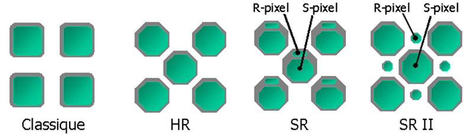

=============================================================
Introduction, numerical images and geometrical representation
=============================================================
:author: David Coeurjolly

.. list-table::
   :class: columns

   * -

     -

     - .. image:: ./_static/images/mosaique.png
          :width: 80%
     - .. image:: ./_static/images/snapshot-K.png
          :width: 80%

Preliminaries
=============

Goals
-----

**Lecutres**

* Introduce fundamental concepts in computer graphics, image
  processing, digital geometry and computational geometry
* Illustrate links between geometrical analysis of shapes and related
  fields (complexity, arithmetics, word theory, ....)

**Practical work (TP)**

* Implement some image processing/shape analysis tools
* Comparative evaluation principles (tests, asymptotical
  vs. experimental computational costs...)

Contexte :   Analysis of geometrical objects
--------------------------------------------

**Geometrical objets**

* From acquisition devices

  * CCD devices
  * tomographic images (IRM, scanners X, ...)

* From modeling processes

  * Geometrical modelers, CAD (computer-aided design)
  * From mathematical modeling of phenomena

**Analysis**

* ... computer-based -> *algorithms*
* ... quantitative

  * Scalar shape descriptors
  * Geometrical paramters
  * Topological invariants, ...
  *  -> *quality, robustness, certified computations, ...*

Couple of Acquisition devices
=============================

CCD Device
----------
*Charged-Coupled Device*

**Principe de base**  régions/pixels photo-actifs : chaque unité de
  surface élémentaire accumule une charge électrique proportionnelle
  à l'intensité  lumineuse reçue.

.. list-table::
   :class: columns

   * - .. image:: ./_static/images/CCD_1D.JPG
          :width: 100%
     - .. image:: ./_static/images/CCD_2D.jpg
          :width: 70%
          :align: center
     - .. image:: ./_static/images/Bayer_pattern_on_sensor.*
          :width: 100%
   * - capteur linéaire [#]_
     - capteur 2D  [#]_
     - Bayer pattern [#]_

**Notion physique de pixels**

[#]_

.. [#] http://en.wikipedia.org/wiki/File:CCD_line_sensor.JPG
.. [#] http://fr.wikipedia.org/wiki/Fichier:CCD_in_camera.jpg
.. [#] http://en.wikipedia.org/wiki/File:Bayer_pattern_on_sensor.*
.. [#] http://fr.wikipedia.org/wiki/Fichier:CCD_Sensor_Layout_Evolution.png

Modélisation associée
---------------------

Par *construction*

* Support est induit par un pavage périodique
* Valeurs quantifiées sur un certain nombre de bits

.. rst-class:: roundedquote

     Image:`\qquad S \subset \mathbb{Z}^n \rightarrow Q\subset \mathbb{Z}^+`:math:

Tomographie
-----------

**Principe de base**

* des particules énergétiques sont émises (ions, protons, photons, ...) depuis une source

* un capteur  mesure leur atténuation lors d'une traversée d'un corps ou d'un objet (atténuation fonction de la durée du vol et des interactions entre la particule et la matière rencontrée)

* l'image est ensuite reconstruite *par inversion des projections*

.. list-table::
   :class: columns

   * - .. image:: ./_static/images/Line_Beam.jpg
          :width: 60%
          :align: center

     - .. image:: ./_static/images/Cone_beam.jpg
          :width: 60%
          :align: center

[#]_ [#]_

.. [#] http://en.wikipedia.org/wiki/File:CT_Scanner_Line_Beam.jpg
.. [#] http://en.wikipedia.org/wiki/File:Cone_beam_image_Cam_320x240.jpg

Tomographie (bis)
-----------------

**Cas d'école**  Théorème de Radon

    `[Rf](t,\theta) = \int_{-\infty}^{+\infty} \int_{-\infty}^{+\infty} f(x,y)\delta(t-x \cos(\theta) - y \sin(\theta)) dxdy`:math:

`\delta`:math: impulsion de Dirac

    .. image:: ./_static/images/sinogramme.png
        :width: 60%

.. rst-class:: roundedquote

     *<demo>*

Tomographie Discrète
--------------------

**Spécificités**

* Directions de projection : droites rationnelles `ax-by=c`:math: (`a,b,c\in\mathbb{Z}`:math:)
* Fonction de projection : somme des valeurs pour les points discrets
  sur la droite rationnelle
* Données à reconstruire : donnée binaire {0,1} ou dans
  `\mathbb{Z}`:math:

**Problèmes**

.. list-table::

 * - * Nombre de projections
     * Unicité de la reconstruction
     * Reconstruction sous hypothèses : convexité, régularité,...

   - .. image:: ./_static/images/pasunicite.png
         :width: 100%
         :align: center

Exemple: Transformation Mojette
-------------------------------

.. container:: build animation

  .. image:: ./_static/images/mojetteempty.*

  .. image:: ./_static/images/mojettefull.*

Tomographie: conclusion
-----------------------

Par *construction* ou par *souci d'efficacité* dans l'inversion du processus
de projections, la reconstruction est souvent structurée sur une
**grille régulière** 2D ou 3D.

.. rst-class:: roundedquote

     Image:`\qquad S \subset \mathbb{Z}^n \rightarrow Q\subset \mathbb{Z}^+`:math:

Acquisition laser/ultra-son/contact
-----------------------------------

**Palpation mécanique** : contact physique

**Approches basées sur un calcul de temps de vol** (e.g. télémètre
  laser, sonar, ...)

.. list-table::

    * -  * mesure le temps d'aller-retour d'une impulsion émise par le
           capteur (laser, ultra-son, ...)
         * *données*: distance à la source pour un ensemble de directions. Après calibration,  `(x,y,z)\in\mathbb{R}^3`:math:

      - .. image:: _static/images/Lidar_P1270901.jpg
           :width: 50%
           :align: center

Approches basées sur le principe de triangulation
-------------------------------------------------

.. list-table::

    * -  * Une impulsion ou un ensemble d'impulsions est émise et est observée sur un autre capteur
           (ex. laser + CCD)
         * La position relative de la source et du capteur étant connue, on
           en déduit une position par triangulation
         * *données* : après calibration, nuage de points
           `(x,y,z)\in\mathbb{R}^3`:math:

      - .. image:: _static/images/LaserPrinciple.png
           :width: 100%
           :align: center

Approches mixtes : exemple  Kinect
----------------------------------

.. list-table::

   * - * Une caméra couleur (CCD, 640x480)
       * *Projection de motifs*  infrarouge  + capteur CMOS (~640x480)

     - .. image:: _static/images/Xbox-360-Kinect-Standalone.png
        :width: 80%
        :align: center

.. list-table::

   * - .. image:: _static/images//Kinect2-ir-image.png
        :width: 80%
        :align: center

     - .. image:: _static/images/Kinect2-deepmap.png
        :width: 80%
        :align: center

*Donnée brute* : carte de profondeur dans le plan 2D du capteur + image couleur

Quiz: pourquoi infrarouge ?

Problématiques
--------------

.. list-table::

  * - .. image:: _static/images/registration_outdoor.png
       :width: 100%
       :align: center
    - .. image:: _static/images/registration_closeup.png
       :width: 100%
       :align: center

* Filtrage (bruit, *outliers*,...)
* Alignement  de nuages de points par calibration ou par *recalage*   [#]_
* Contrôle de la densité locale
* Que faire des parties occultées ?
* ...

.. [#] Point Cloud Library

Problématiques (bis)
--------------------

**Reconstruction géométrique** définir une *surface* de *qualité*   *approximant* ou *interpolant* au mieux le nuage de points. [#]_

.. image:: _static/images/introduction.jpg
   :width: 50%
   :align: center

* *Surface* : on verra plus tard
* *Qualité*

  * distance aux échantillons (quelle métrique ? comment être robuste au bruit ?...)
  * caractère lisse de la surface
  * garantie géométrique et topologique de la reconstruction
* ...

.. [#] CGAL.org

Quelques périphériques
======================

Écran matriciel
---------------

**Principe**

* Luminophores composés de cellules RVB (rouge, vert, bleu)  pour rendu couleur additif
* Pour ce qui nous concerne:

  - Image couleur : `[0..n]\times[0..m] -> Q^3`:math:
  - `Q`:math: : dynamique de chaque canal couleur (8bits, 24bits, ...)

.. list-table::

 * - .. image:: _static/images/CRT_color.png
         :width: 80%
         :align: center

   - .. image:: _static/images/Liquid_Crystal_Display_Macro_Example_zoom_2.jpg
         :width: 80%
         :align: center

   - .. image::  _static/images/Synthese.png
         :width: 80%
         :align: center

**Problèmatiques**

* Modèles géométrique `\rightarrow`:math: représentation discrète
* ex: tracé de segments, cercles, ...

Imprimantes 3D
--------------

**Approche par dépôt en couche**

* Approche additive : ajoute de  matière couche par couche
* Plusieurs technologies : dépôt de résine chauffée, stéréolithographie (solidification résine par éclairage ultra-violet), ...
* Point commun : contrôlé par une représentation discrète `\,f: \mathbb{Z}^3 \rightarrow \{0,1\}`:math: de l'objet à "imprimer"

.. list-table::

   * - .. image:: _static/images/Airwolf_3d_Printer.jpg
         :width: 80%
         :align: center

     - .. image:: _static/images//Rapid_prototyping_slicing.jpg
         :width: 80%
         :align: center

     - .. image:: _static/images/3D_scanning_and_printing.jpg
         :width: 80%
         :align: center

**Problèmatiques**

* Modèles géométrique `\rightarrow`:math: représentation discrète en extension
* Contrôle topologique dans la discrétisation
* Analyse géométrique géométrie : anticiper la fragilité de certaines structures géométriques...

Survol des disciplines
======================

Glossaire subjectif
-------------------

**Image Processing** (traitement et analyse d'images)

* analyse d'image au sens large
* l'image est souvent vue comme la réalisation d'un signal bi-dimensionnel
* mots-clefs: filtrage, colorimétrie, segmentation, ...

**Computer Vision** (Vision par ordinateur, reconnaissance de formes,..)

* s'intéresse à la perception des objets
* mots-clefs: reconnaissance de
  forme, reconstruction d'environnement basée image, reconstruction stéréoscopique, ...

Glossaire subjectif (bis)
-------------------------

**Géométrie Algorithmique**

* données discrètes également : structures discrètes (points, ensemble de facettes..)
* cherche à définir des structures de données (ex. reconstruction) ou
  algorithmes permettant l'analyse géométrique
* algorithmique certifiée
* complexité

**Géométrie discrète**

* La structure du support est fondamentale (grille régulière `\Rightarrow`:math: arithmétique entière)
* Les valeurs sont souvent discrètes, voire binaires
* *prendre des décisions géométriques exactes sur des objets donnés en extension*  (vs. compréhension)

Glossaire subjectif (ter)
-------------------------
**Modélisation géométrique**

* Modélisation d'objets/scènes géométriques 3D
* Animation, ...

**Synthèse d'images**

* Produire des images de qualité à partir d'objets/scènes 3D
  modélisées
* Lancer de rayon, radiosité, suivi de photons, ...

Plan du cours
=============

Plan
----

**Analyse et traitement d'images**

* filtrage, segmentation
* correction d'histogramme
* morphologie mathématique
* Segmentation

**Géométrie discrète**

* Modèle discret, toplogie digitale
* Analyse surfacique d'objets discrets
* Analyse volumique
* Transformations rapides

**Géométrie algorithmique**

* Enveloppes convexes, triangulation de Delaunay,...
* Structures de données de localisation
* ...
